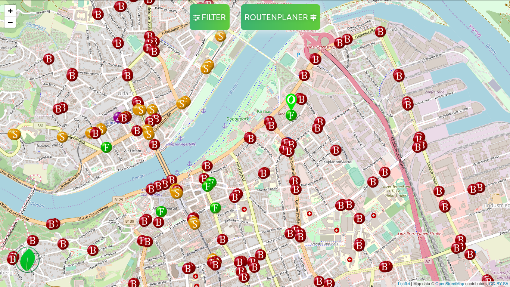

# OeGOe-Code
<h2> Österreichische Grüne Öffis</h2>
<h5> Weltweit Nutzbar</h5>
App-Data / HTML Code for Web-Map with Jugendhackt

Eine Webseite zur Verbesserung der Nutzung von Öffentlichen/Grünen Verkehrsmitteln.

Developed by Jenny Luger, Jan Sallaberger, Male Kremsmayr, Vertschi Kremsmayr, Torben Baumgartner.

Mentored by Herman Lacheiner, Thomas Rupprecht.

